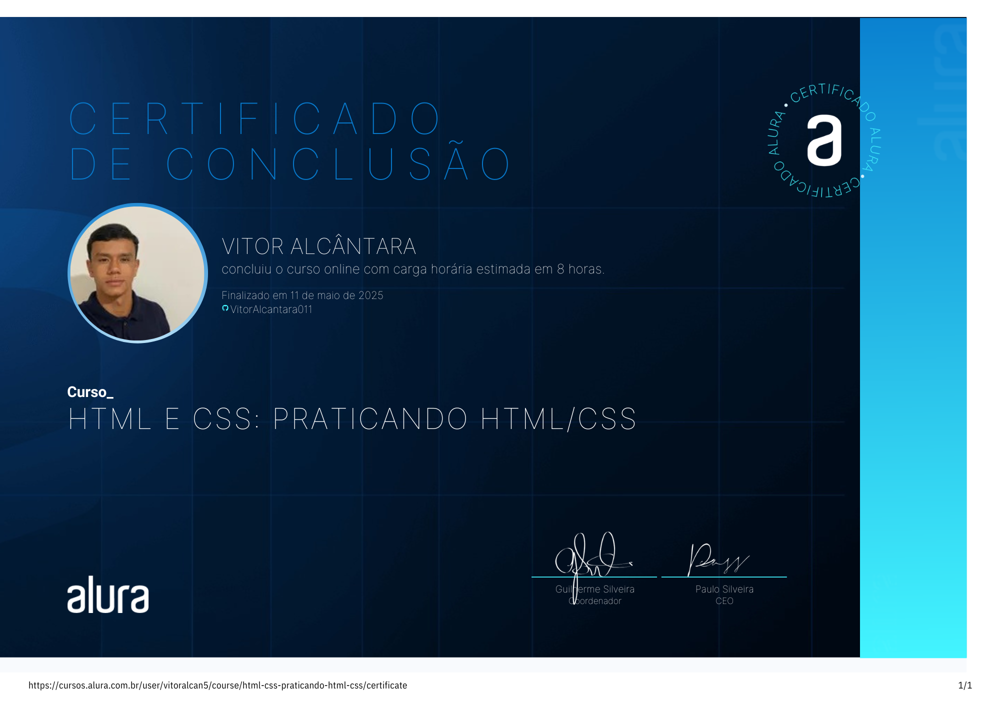

<h1>Alura-Plus</h1>

  Neste curso desenvolvi um site para a Alura+ com intuito de práticar meus conhecimentos de HTML e CSS, desenvolvendo
funcionalidades para links âncora (para encaminhar para outras páginas), sendo um site responsivo para ser acessado em qualquer dispositivo.

## 🛠 Tecnologias Utilizadas
<code></code>
<code></code>

➡️ Acesse o site aqui: https://alura-plus-delta-virid.vercel.app/

 

⬇️ Certificado do Curso:

